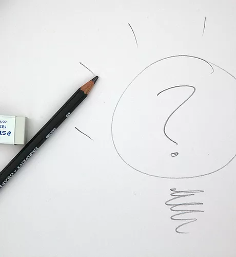

```{r setup, include=FALSE}
knitr::opts_chunk$set(echo = FALSE)

# Learn more about creating websites with Distill at:
# https://rstudio.github.io/distill/website.html

# Learn more about publishing to GitHub Pages at:
# https://rstudio.github.io/distill/publish_website.html#github-pages

```


## PURPOSE


{width=50%}


We study learning and development of cognitive skills in formal and informal educational systems. Our goal is to understand disparities in educational opportunities, and their relation to cognitive development. 


Another goal of ours is to use this knowledge to develop and evaluate interventions that promote cognitive development, particularly in disadvantaged students.

## COGNITIVE SKILLS


{width=50%}


We define cognitive skills to include traditional academic skills such as reading and math skills, but also other important skills related to executive functioning, critical reasoning, motivation, and social skills, among others.

## METHODS


{width=50%}


We utilize a broad set of research methods to understand these issues, but our general approach involves model building and testing in efforts to understand the underlying processes that support successful learning and development.

